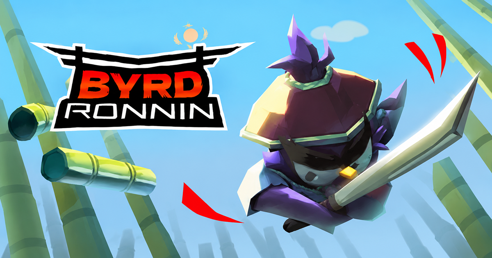
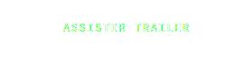

<div align="center">



<br/>
<br/>

# BYRD RONIN — Landing Page

**Landing page oficial do jogo Byrd Ronin, desenvolvida para converter visitantes em wishlists e compras na Steam.**

<br/>

[](https://taglieri.me/byrd-ronin/)

<br/>

<a href="https://store.steampowered.com/app/4378340/Byrd_Ronin/"></a>
&nbsp;&nbsp;
<a href="https://www.youtube.com/watch?v=Dl2vowH1bf4"></a>

<br/>

</div>

---

## 侍 &nbsp; Sobre o Jogo

> _"Evolua a cada run, desbloqueie itens e habilidades, domine o fluxo do combate e sobreviva ao caos — este é o caminho do Ronin."_

**Byrd Ronin** é um roguelite de ação 2D pixel art frenético. Como um pássaro Ronin, avance destruindo tudo até alcançar a cerejeira que guarda seu juramento. Combate rápido, agressivo e recompensador — saber o momento certo de atacar e contra-atacar é a única constante.

|                   |                                   |
| ----------------- | --------------------------------- |
| **Desenvolvedor** | RDB's Studio                      |
| **Gênero**        | Ação · Roguelike · Hack and Slash |
| **Plataforma**    | PC (Steam)                        |
| **Lançamento**    | 8 de Abril de 2026                |
| **Preço**         | R$ 9,99                           |

---

## ⚔️ &nbsp; Sobre a Landing Page

Experiência visual imersiva construída para maximizar conversões na Steam. A página replica a estética pixel art do jogo com animações de entrada, partículas e efeitos de sombra offset — tudo sem sacrificar performance.

**Seções:**

```
Navbar  →  Hero  →  Trailer  →  Features  →  Gameplay Grid  →  FAQ  →  Final CTA  →  Footer
```

---

## 🛠️ &nbsp; Stack Técnica

| Tecnologia           | Versão | Uso                               |
| -------------------- | ------ | --------------------------------- |
| **Astro**            | 5.8    | Framework principal / SSG         |
| **React**            | 19     | Componentes interativos (islands) |
| **Tailwind CSS**     | v4     | Estilização utilitária            |
| **Framer Motion**    | 12     | Animações de scroll e entrada     |
| **TypeScript**       | 5.8    | Tipagem estática                  |
| **@astrojs/react**   | 5.0    | Integração React no Astro         |
| **@astrojs/sitemap** | 3.7    | SEO / sitemap automático          |

---

## 🚀 &nbsp; Rodando Localmente

```bash
# Instalar dependências
npm install

# Iniciar servidor de desenvolvimento
npm run dev
# → http://127.0.0.1:4321

# Build de produção
npm run build

# Preview do build
npm run preview
```

---

## 📁 &nbsp; Estrutura do Projeto

```
src/
├── components/
│   ├── react/              # Islands React (interativos)
│   │   ├── TrailerPlayer.tsx
│   │   ├── FeatureGrid.tsx
│   │   ├── GameplayGridClient.tsx
│   │   ├── FinalCTAClient.tsx
│   │   ├── NavbarClient.tsx
│   │   ├── FAQSection.tsx
│   │   ├── HeroAnimations.tsx
│   │   ├── SteamButtonAnimated.tsx
│   │   ├── AnimatedSectionHeader.tsx
│   │   └── particles/
│   │       ├── PixelParticles.tsx
│   │       ├── FallingLeaves.tsx
│   │       └── ShurikenParticles.tsx
│   └── *.astro             # Seções estáticas
├── layouts/
│   └── BaseLayout.astro    # HTML base + SEO
├── pages/
│   ├── index.astro         # Página principal
│   └── 404.astro
├── lib/
│   ├── motion.ts           # Variantes Framer Motion
│   └── useCanvasAnimation.ts
└── consts.ts               # Dados do jogo e URLs
public/
├── images/                 # Hero, OG image, features
├── logos/                  # Byrd Ronin + RDB's Studio
├── icons/                  # Steam, YouTube, Instagram, itch.io
└── videos/                 # Gameplay clips (webm)
```

---

## 🎨 &nbsp; Design System

| Token          | Valor     | Uso                  |
| -------------- | --------- | -------------------- |
| `--black`      | `#050505` | Background principal |
| `--ink`        | `#0b1220` | Cards dark           |
| `--blue`       | `#0788d9` | Accent primário      |
| `--blue-light` | `#49c2f2` | Highlights           |
| `--gold`       | `#bfb52c` | Accent secundário    |
| `--red`        | `#f21313` | CTA principal        |
| `--white`      | `#f8fafc` | Texto principal      |

**Tipografia:** `Pixelify Sans` (display) + `Inter` (corpo)

**Estilo visual:** Sombras com offset pixel art (`8px 8px 0 <cor>`), bordas nítidas, sem blur em cards.

---

<div align="center">

Feito com ⚔️ por [Vinícius Tagliéri](https://github.com/ViniciusTaglieri)

</div>
